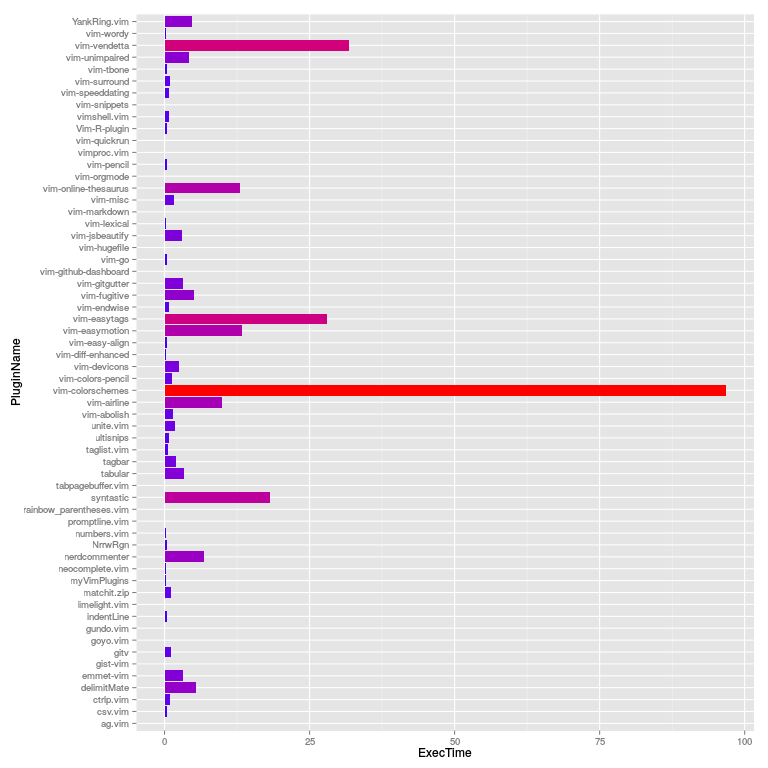

Here is a screenshot to have a quick look at what this is all about.



Here is a peek at the profiling result for my plugins:

```

Generating vim startup profile...    
Parsing vim startup profile...     
Crunching data and generating profile plot ...    
     
Your plugins startup profile graph is saved     
as `profile.png` under current directory.    
     
==========================================    
Top 10 Plugins That Slows Down Vim Startup    
==========================================    
   1	105.13	"vim-colorschemes"    
   2	42.661	"vim-easytags"    
   3	31.173	"vim-vendetta"    
   4	22.02	"syntastic"    
   5	13.362	"vim-online-thesaurus"    
   6	7.888	"vim-easymotion"    
   7	6.931	"vim-airline"    
   8	6.608	"YankRing.vim"    
   9	5.266	"nerdcommenter"    
  10	5.017	"delimitMate"    
==========================================    
Done!    
```

## Story

If you use vim-plug (or other amazing plugin manager of your choice) to install
your vim (gvim or macvim) plugins, then chances are high that it gets
addictive. You will find yourself with several dozens of useful plugins. 

vim-plug (and NeoBundle) offers you to load your plugins on-demand (lazy-loading). But
which needs fine tuning? Well, using vim's built-in profiling `vim
--startuptime` you can get a timing for all function calls during
startup. However, the data is for each functions. You will have to
figure out the math, and make sure those functions calls are form the
same plugins. Even some sorting might help, but sorting the timing for
each functions does not really make sense because it is really time of the
plugins (but not the functions) that you really care about.  

I am poor at doing mental math, even for simple sums. However, with the power
of a simple bash script and R, we can get all we want.


### Supported Plugin-Managers

Here is the list of supported managers. Hopefully, your favourite plugin manager is among the list. If not, or if you prefer to manage your own plguins (using symlinks, of course), we could still adjust the code.

 - [vim-plug]
 - [NeoBundle]
 - [Vundle]
 - [Pathogen]


### Installation

This is *NOT* a vim plugin! This is simply a profiler for your vim
plugins that are installed through various plugin managers such as
vim-plug.

Download the `.zip` [here][zip] and then simply run the bash script:


```BASH
sh ./vim-plugins-profile.sh

# Alternatively use Ruby powers! Less dependency, graph with ASCII art
ruby ./vim-plugins-profile.rb

# To use an alternative executable such as neovim, pass it as the first argument.
ruby ./vim-plugins-profile.rb nvim
```

Then open the `profile.png` file for the result! It is that simple.


### Dependency

You will need to install several tools before you can run this. Chances are that you already have them. The script prompts whether it should install the `R:ggplot2` package if you already have `R`. Here are the list of dependencies:

 - [R]
 - [R:ggplot2] (the ggplot2 package for R)
 - Bash (Cygwin, or Git for Windows will also work)

Alternatively, you could use `Ruby` for the same analysis. It does not depend on extra libraries, but will not produce eye-candy graphs either.

### TODO

- Maybe optionally use `gnuplot` or `matplotlib` instead of `R:ggplot2` if any of the other two are installed already. 

[zip]: https://github.com/hyiltiz/vim-plugins-profile/archive/master.zip
[vim-plug]: https://github.com/junegunn/vim-plug
[R]: https://cran.r-project.org/
[R:ggplot2]: http://ggplot2.org/
[NeoBundle]: https://github.com/Shougo/neobundle.vim
[Vundle]: https://github.com/VundleVim/Vundle.vim
[Pathogen]: https://github.com/tpope/vim-pathogen
